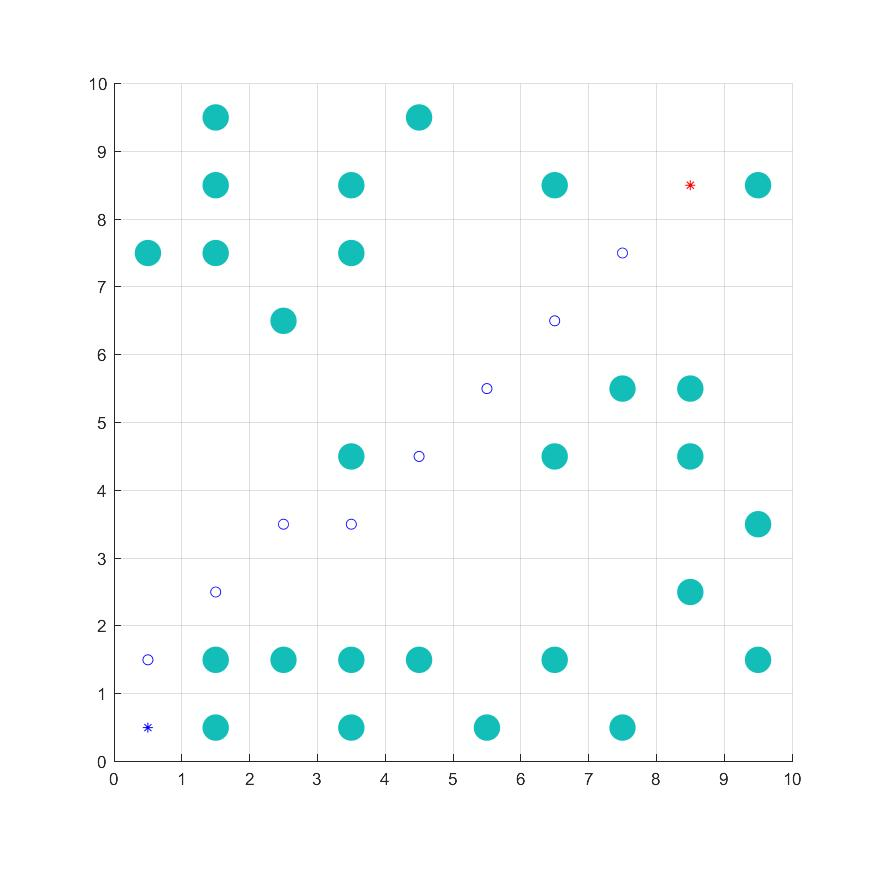

Use the script "math.m" as the main entry point.
使用math.m作为主函数入口

# A_star: useful functions for A*

## distance.m

This function calculates the distance between any two cartesian coordinates.

用于计算笛卡尔坐标系下任意两点的距离（此函数可以用作修改启发函数，例如将距离计算换做曼哈顿距离）

## insert_open.m

Function to Populate the OPEN LIST，IS ON LIST 1/0 |X val |Y val |Parent X val |Parent Y val |h(n) |g(n)|f(n)|

用于将node加入OPEN_LIST中，OPEN的规定格式为一个8*1数组：|1/0 |X val |Y val |Parent X val |Parent Y val |h(n) |g(n)|f(n)|
           
## expand_array.m
This function takes a node and returns the expanded list  of successors,with the calculated fn values.

用于返回node n 周围的m个扩展node的列表，规定格式为一个m*5*1数组：|X val |Y val ||h(n) |g(n)|f(n)|

## min_fn.m
This function takes the list OPEN as its input and returns the index of the node that has the least cost
	              
用于返回OPEN列表中cost最小的node的索引

## node_index.m 
This function returns the index of the location of a node in the list OPEN
  	              
用于返回OPEN列表中坐标为（xval,yval）的node的索引

## A_star_search.m
This unfinished function is your homework, you can use the functions in the folder A_star, or you can do the whole work yourself.

作业部分完成A_star_search.m，输出路径点列表，规定格式为n*2*1数组：|x_val | y_val，可以选择使用A_start里写好的函数，也可以独立完整完成所有工作。

## obstacle_map:
This function returns a map contains random distribution obstacles.
    
用于返回一个含有随意分布障碍物的地图（障碍物出现概率可以通过改变obstacle_ratio的数值大小来实现）

## visualize_map: 
This function visualizes the 2D grid map consist of obstacles/start point/target point/optimal path.

用于可视化二维的栅格地图，包含障碍物、起点、终点和最优路径点

# 效果展示

## 存在路径

## 不存在路径

